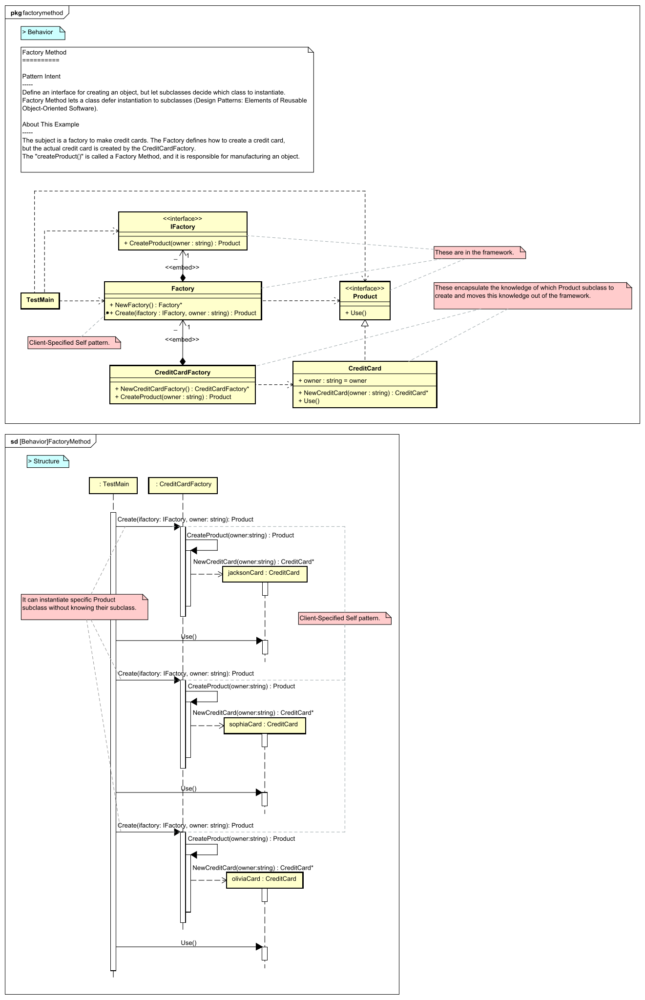
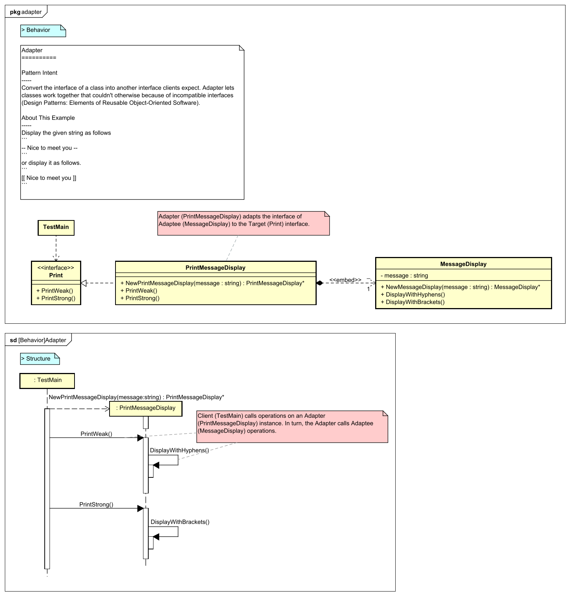
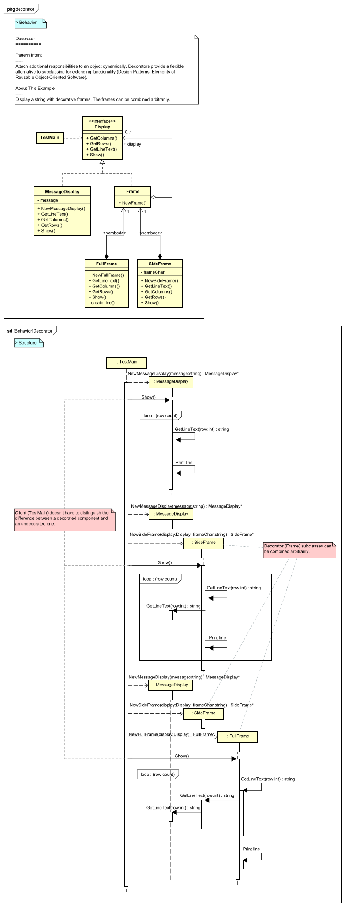

UML Diagram for Golang Design Pattern Examples
===

This project lists UML diagrams of the "[Design Pattern Examples in Golang](https://github.com/takaakit/design-pattern-examples-in-golang)". When you click on a diagram image, the diagram will be opened in **Diagram Map**. If you want to know about Diagram Map, see [this post](https://dev.to/takaakit/diagram-map-tracing-uml-sysml-elements-across-diagrams-49i7).

Behavioral Patterns
---
|  |  |  |
| :---: | :---: | :---: |
| **Chain of Responsibility** | **Command** | **Interpreter** |
|  <a href="https://github.com/takaakit/design-pattern-examples-in-golang/tree/master/behavioralpatterns/chainofresponsibility">Golang Code</a> <a href="./behavioralpatterns/chainofresponsibility/ExecutionResult.png">Execution Result</a> |  <a href="https://github.com/takaakit/design-pattern-examples-in-golang/tree/master/behavioralpatterns/command">Golang Code</a> <a href="./behavioralpatterns/command/ExecutionResult.png">Execution Result</a> |  <a href="https://github.com/takaakit/design-pattern-examples-in-golang/tree/master/behavioralpatterns/interpreter">Golang Code</a> <a href="./behavioralpatterns/interpreter/ExecutionResult.png">Execution Result</a> |
| **Iterator** | **Mediator** | **Memento** |
|  <a href="https://github.com/takaakit/design-pattern-examples-in-golang/tree/master/behavioralpatterns/iterator">Golang Code</a> <a href="./behavioralpatterns/iterator/ExecutionResult.png">Execution Result</a> |  <a href="https://github.com/takaakit/design-pattern-examples-in-golang/tree/master/behavioralpatterns/mediator">Golang Code</a> <a href="./behavioralpatterns/mediator/ExecutionResult.png">Execution Result</a> |  <a href="https://github.com/takaakit/design-pattern-examples-in-golang/tree/master/behavioralpatterns/memento">Golang Code</a> <a href="./behavioralpatterns/memento/ExecutionResult.png">Execution Result</a> |
| **Observer** | **State** | **Strategy** |
|  <a href="https://github.com/takaakit/design-pattern-examples-in-golang/tree/master/behavioralpatterns/observer">Golang Code</a> <a href="./behavioralpatterns/observer/ExecutionResult.png">Execution Result</a> |  <a href="https://github.com/takaakit/design-pattern-examples-in-golang/tree/master/behavioralpatterns/state">Golang Code</a> <a href="./behavioralpatterns/state/ExecutionResult.png">Execution Result</a> |  <a href="https://github.com/takaakit/design-pattern-examples-in-golang/tree/master/behavioralpatterns/strategy">Golang Code</a> <a href="./behavioralpatterns/strategy/ExecutionResult.png">Execution Result</a> |
| **Template Method** | **Visitor** |  |
|  <a href="https://github.com/takaakit/design-pattern-examples-in-golang/tree/master/behavioralpatterns/templatemethod">Golang Code</a> <a href="./behavioralpatterns/templatemethod/ExecutionResult.png">Execution Result</a> |  <a href="https://github.com/takaakit/design-pattern-examples-in-golang/tree/master/behavioralpatterns/visitor">Golang Code</a> <a href="./behavioralpatterns/visitor/ExecutionResult.png">Execution Result</a> |  |

Creational Patterns
---
|  |  |  |
| :---: | :---: | :---: |
| **Abstract Factory** | **Builder** | **Factory Method** |
|  <a href="https://github.com/takaakit/design-pattern-examples-in-golang/tree/master/creationalpatterns/abstractfactory">Golang Code</a> <a href="./creationalpatterns/abstractfactory/ExecutionResult.png">Execution Result</a> |  <a href="https://github.com/takaakit/design-pattern-examples-in-golang/tree/master/creationalpatterns/builder">Golang Code</a> <a href="./creationalpatterns/builder/ExecutionResult.png">Execution Result</a> |  <a href="https://github.com/takaakit/design-pattern-examples-in-golang/tree/master/creationalpatterns/factorymethod">Golang Code</a> <a href="./creationalpatterns/factorymethod/ExecutionResult.png">Execution Result</a> |
| **Prototype** | **Singleton** |  |
|  <a href="https://github.com/takaakit/design-pattern-examples-in-golang/tree/master/creationalpatterns/prototype">Golang Code</a> <a href="./creationalpatterns/prototype/ExecutionResult.png">Execution Result</a> |  <a href="https://github.com/takaakit/design-pattern-examples-in-golang/tree/master/creationalpatterns/singleton">Golang Code</a> <a href="./creationalpatterns/singleton/ExecutionResult.png">Execution Result</a> |  |

Structural Patterns
---
|  |  |  |
| :---: | :---: | :---: |
| **Adapter** | **Bridge** | **Composite** |
|  <a href="https://github.com/takaakit/design-pattern-examples-in-golang/tree/master/structuralpatterns/adapter">Golang Code</a> <a href="./structuralpatterns/adapter/ExecutionResult.png">Execution Result</a> |  <a href="https://github.com/takaakit/design-pattern-examples-in-golang/tree/master/structuralpatterns/bridge">Golang Code</a> <a href="./structuralpatterns/bridge/ExecutionResult.png">Execution Result</a> |  <a href="https://github.com/takaakit/design-pattern-examples-in-golang/tree/master/structuralpatterns/composite">Golang Code</a> <a href="./structuralpatterns/composite/ExecutionResult.png">Execution Result</a> |
| **Decorator** | **Facade** | **Flyweight** |
|  <a href="https://github.com/takaakit/design-pattern-examples-in-golang/tree/master/structuralpatterns/decorator">Golang Code</a> <a href="./structuralpatterns/decorator/ExecutionResult.png">Execution Result</a> |  <a href="https://github.com/takaakit/design-pattern-examples-in-golang/tree/master/structuralpatterns/facade">Golang Code</a> <a href="./structuralpatterns/facade/ExecutionResult.png">Execution Result</a> |  <a href="https://github.com/takaakit/design-pattern-examples-in-golang/tree/master/structuralpatterns/flyweight">Golang Code</a> <a href="./structuralpatterns/flyweight/ExecutionResult.png">Execution Result</a> |
| **Proxy** |  |  |
|  <a href="https://github.com/takaakit/design-pattern-examples-in-golang/tree/master/structuralpatterns/proxy">Golang Code</a> <a href="./structuralpatterns/proxy/ExecutionResult.png">Execution Result</a> | | |

References
---
* Gamma, E. et al. Design Patterns: Elements of Reusable Object-Oriented Software, Addison-Wesley, 1994
* Hiroshi Yuki. Learning Design Patterns in Java [In Japanese Language], Softbank publishing, 2004
* Schmager, F. Evaluating the GO Programming Language with Design Patterns, 2010

Links
---
* [Design Pattern Examples in Golang](https://github.com/takaakit/design-pattern-examples-in-golang)
* [Diagram Map: tracing UML/SysML elements across diagrams](https://dev.to/takaakit/diagram-map-tracing-uml-sysml-elements-across-diagrams-49i7)

Licence
---
Diagram Map file (DiagramMap.html) includes the following libraries:
* [D3 library](https://d3js.org) is copyrighted by Mike Bostock and is released under the [BSD license](https://opensource.org/licenses/BSD-3-Clause).
* [Popper library](https://popper.js.org/) is copyrighted by Federico Zivolo and is released under the [MIT license](https://opensource.org/licenses/MIT).
* [Tippy library](https://atomiks.github.io/tippyjs/) is copyrighted by atomiks and is released under the [MIT license](https://opensource.org/licenses/MIT).

Files and data in this project other than the above libraries are under the [Creative Commons Zero (CC0) license](https://creativecommons.org/publicdomain/zero/1.0/).
